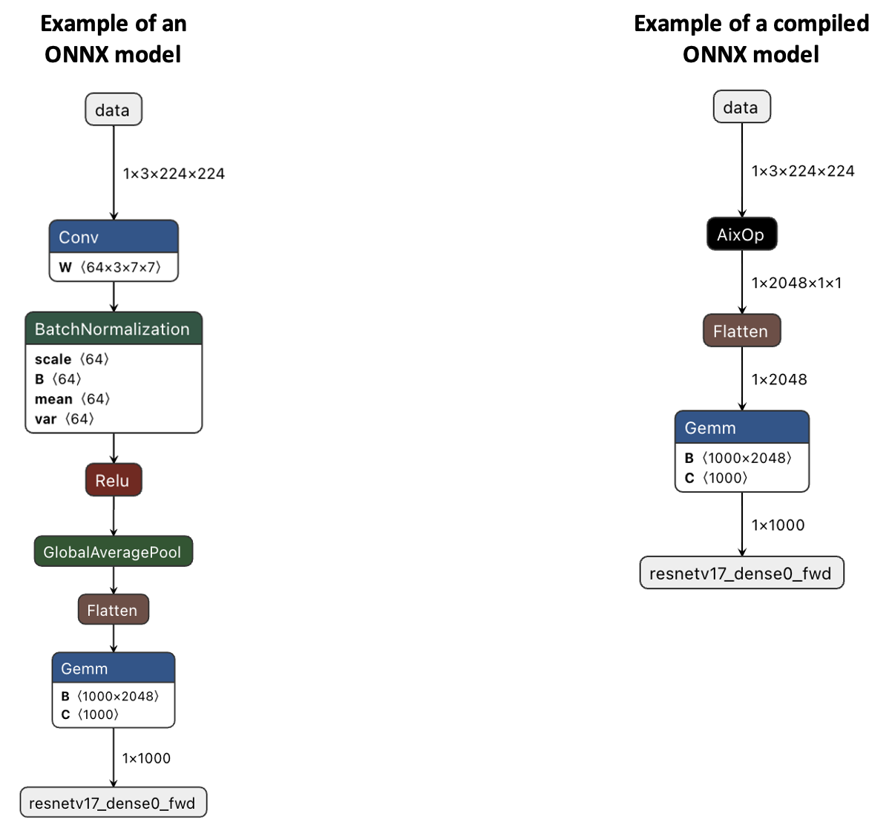

# SKT AIX Frontend Compiler

This README describes the organization and usage of the SKT AIX Frontend Compiler.

## **Release Note v1.0 (UAT)**

### **New Updates**

This release includes features:

1. Enable to compile ONNX-to-AIXGraph  

    We have implemented parser and translator for ONNX model, the following files were added for the purpose of this implementation:  

    * src/AxfcONNXIRBuilder: parser for ONNX graph
    * src/AxfcONNXIRTranslator: translator for ONNX graph   
    * src/AxfcONNXWriter: custom model generator for ONNX model 

2. Enable to generate ONNX custom graph.  

    The custom model replaces AIXGraph with AIXOp (custom domain) on ONNX model.
    
    
        
    * Example of an ONNX model and compiled ONNX model  

    This feature should be able to generate any type of ONNX graph, including multiple AIXOps support.

3. Option to choose AIXGraph in binary or text format

    You can pick a format between binary and text format for generating AIXGraph.   
    The binary format is preferred and is set to default for the compilation due to having inferior for writing to file time.  
    However, the text format serves the  purpose of testing and debugging. Please refer to README.md file for usage 
    guideline.

4. Support multiple AIXGraphs or/and AIXOps for TensorFlow and ONNX

    Like shown in No.2 multiple AIXGraphs can be generated from a model and supported model includes, TensorFlow and ONNX.

### **Open Issues**

This release contains the following issue that needs to be addressed:

1. Generated AIXGraph only contains input information (type, dims, size) but does not contain input value (fval) for AIX_LAYER_INPUT.    

    Generated AIXGraph only contains input information:

      * Generated AIXGraph get the input from the previous node in the model so it only contains input information like type, dims and size.  
      It doesn’t contain the input value (fval) for the AIX_LAYER_INPUT node. Due to this reason, when testing with AIXGraph simulator, the input value (fval) needs to be manually inserted.
      
      

2. TensorFlow custom model cannot be generated due to the required re-implementation of the custom operation kernel to change support from Darknet to AIXGraph simulator.

    TensorFlow custom model cannot be generated:

    * In this release, the compiler can generate AIXGraph, includes multiple AIXGraph from a model.  
     However, the custom model that contains AIXOp cannot be generated. Because to generate a custom operation like AIXOp on TensorFlow, it is required to have a custom kernel for that specific operation.  
     Previously, we implemented the custom kernel using Darknet but now we have shifted to use on AIXGraph simulator. Thus, the custom kernel needs to be rewritten to support on AIXGraph simulator.

## **Source Organization**

### **Common**

* AxfcFrontendCompiler
* AxfcIRBuilder
* AxfcIRTranslator
* AxfcMachineDesc
* AxfcGraphWriter
* AxfcLauncherWriter
* AxfcLauncher  
* AxfcIRGraph
* AxfcIRBlock
* AxfcIRNode
* AxfcError
* AxfcMain

### **Util**

* AxfcAIXLayerView
* AxfcCustomGraph
* AxfcTFGraphUtil
* AxfcUtil

### **Tensorflow**

* AxfcTFIRBuilder
* AxfcTFIRTranslator

### **SKT-AIX**

* aixh_pb2

## **Prerequisites**
* Install Dependencies 
  ```
  $ pip3 install -r requirements.txt
  ```

## **Usage** 
Our frontend compiler currently provides 2 ways for the executing, by using Makefile or python3 command line.

### **Using Python3 Command Line**
To use the python3 command line, we have to pass the required arguments listed below.

**Required Arguments**
    
    -m: path to a machine description file 
    -i: path to the protocol buffer of a frozen model

 **Optional Arguments**

    -c: Path to the calibration data of a frozen model (optional)
    -o: Path to output the generated AIXGraph (optional)
    -l: Path to log out (optional)
    -g: Path to dump out an IR graph (optional)
    -f: Configure output for aix graph format between 'binary' and 'text' (optional, default is binary)
  Note:

* For -f argument, we recommend to use binary format as it is much faster for dumping the aix graph.
 
 **Example**

1. On terminal, go to aix frontend compiler directory
    ```    
    $ cd skt-aix-frontend-compiler
    ```
2. Run aix compiler
   ```
   $ python3 src/AxfcMain.py -m=tst/machine_description.md -i=tst/model_name.pb -f=text
   ```

   Note: you can find sample machine description file for ONNX model (onnx_sample.md) and TensorFlow model (tf_sample.md) in the 'skt-aix-frontend-compiler/tst' directory.

### **Using Makefile:**
To use the makefile, please follow the following steps below:

1. Configure makefile, go to edit Makefile at path ``skt-aix-frontend-compiler/Makefile``


2. Fill in the required parameter belows:
   ```
   MODEL= ./tst/model_name.pb 
   MD= ./tst/model_description.md
   ```
3. On terminal, go to aix frontend compiler directory:
    ```    
    $ cd skt-aix-frontend-compiler
    ```
4. Run Makefile
    ```
    $ make all
    ```

## **Contact**

Youngsun Han (youngsun@pknu.ac.kr)

* Associate Professor
* Department of Computer Engineering, Pukyong National University

Sengthai Heng (sengthai37@gmail.com)

* Graduated Student
* Department of AI Convergence, Pukong National University

Leanghok Hour (leanghok@pukyong.ac.kr)

* Graduated Student
* Department of AI Convergence, Pukyong National University

Sanghyeon Lee (sanghyeon@pukyong.ac.kr)

* Graduated Student
* Department of AI Convergence, Pukyong National University

Myeongseong Go (gms3089@pukyong.ac.kr)

* Graduated Student
* Department of AI Convergence, Pukyong National University