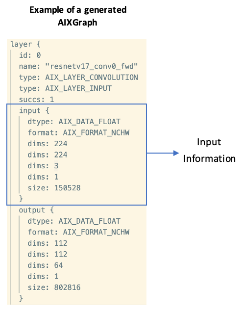

Here's the updated README with the explanation of the output file generated after running `make run`:

---

# SKT AIX Frontend Compiler

This README describes the organization and usage of the SKT AIX Frontend Compiler.

## **Release Note v2.0 (UAT)**

### **New Updates**

This release includes features:

1. Enable to compile PyTorch-to-AIXGraph

We have implemented a parser and translator for PyTorch models. The following files were added for this implementation:

- `src/AxfcPyTorchIRBuilder`: Parser for PyTorch graph
- `src/AxfcPyTorchIRTranslator`: Translator for PyTorch graph
- `src/AxfcPyTorchWriter`: Generates `AIXGraph` from a PyTorch model

2. Support multiple AIXGraphs or AIXOps for TensorFlow, ONNX, and PyTorch

Multiple `AIXGraphs` can be generated from a model, with supported frameworks including TensorFlow, ONNX, and PyTorch.

### **Open Issues**

This release contains the following issue that needs to be addressed:

1. Generated `AIXGraph` only contains input information (type, dims, size) but does not contain input value (`fval`) for `AIX_LAYER_INPUT`.

The generated `AIXGraph` only contains input information:

- The generated `AIXGraph` gets the input from the previous node in the model, so it only contains input information like type, dims, and size.
- It doesn’t contain the input value (`fval`) for the `AIX_LAYER_INPUT` node. For this reason, when testing with the `AIXGraph` simulator, the input value (`fval`) needs to be manually inserted.



## **Source Organization**

### **Common**

- `AxfcFrontendCompiler`
- `AxfcIRBuilder`
- `AxfcIRTranslator`
- `AxfcMachineDesc`
- `AxfcGraphWriter`
- `AxfcLauncherWriter`
- `AxfcLauncher`
- `AxfcIRGraph`
- `AxfcIRBlock`
- `AxfcIRNode`
- `AxfcError`
- `AxfcMain`

### **Util**

- `AxfcAIXLayerView`
- `AxfcCustomGraph`
- `AxfcTFGraphUtil`
- `AxfcUtil`

### **TensorFlow**

- `AxfcTFIRBuilder`
- `AxfcTFIRTranslator`
- `AxfcTFWriter`

### **ONNX**

- `AxfcONNXBuilder`
- `AxfcONNXIRTranslator`
- `AxfcONNXWriter`

### **PyTorch**

- `AxfcPTBuilder`
- `AxfcPTTranslator`
- `AxfcPTWriter`

### **SKT-AIX**

- `aixh_pb2`

## **Prerequisites**

Install Dependencies (Ubuntu 20.04~)

To avoid module conflicts, we recommend creating a virtual environment. The `Makefile` automatically creates and configures a virtual environment (`venv`) when you run `make all`. It sets up the necessary environment and installs the required packages.

If you need to set up the virtual environment manually for any reason, you can follow these steps:

```bash
$ python3 -m venv {virtual_env_name}

1. Ubuntu
$ cd {virtual_env_name}
$ source bin/activate

2. Windows
$ cd {virtual_env_name}/Scripts
$ activate.bat
```

And install the required packages:

```bash
$ pip3 install -r requirements.txt
```

If the `onnx_graphsurgeon` package is not installed successfully, please check the latest version and install it manually:

```bash
$ pip3 install onnx_graphsurgeon=={latest_version}
```

## **Usage**

Our frontend compiler currently provides 2 ways for execution: using a Makefile or the `python3` command line.

### **Using Makefile**

The `Makefile` simplifies the process of setting up the environment and running the compiler.

To use the Makefile, please follow the steps below:

1. Configure the Makefile by editing it at path `skt-aix-frontend-compiler/Makefile`.

2. Fill in the required parameters:

```makefile
MODEL= ./tst/model_name.pb
MD= ./tst/model_description.md
```

3. On the terminal, navigate to the AIX frontend compiler directory:

```bash
$ cd skt-aix-frontend-compiler
```

4. Run the Makefile:

```bash
$ make all
```

This will:
- Create and activate a virtual environment (`venv`).
- Install the required Python packages.
- Compile the specified model to generate an `AIXGraph`.

5. To run the frontend compiler and generate the `AIXGraph`, execute:

```bash
$ make run
```

### **Output: AIXGraph**

- The output of the frontend compiler is an `AIXGraph`, which is a serialized representation of the model suitable for execution on the AIX simulator.
- After running `make run`, an output file named `aixgraph.out.0.pb` (for binary format) or `aixgraph.out.0.pbtxt` (for text format) will be created in the output directory specified in the Makefile.
  - The format of the output depends on the `-f` argument specified (either `'binary'` or `'text'`).
- This `AIXGraph` file serves as the input to the simulator for performing inference or other operations.

### **Cleaning Up Files**

To clean up build artifacts and temporary files generated during execution (such as `__pycache__`, `venv`, and `tst/aix_graph.out.*`), run the `make clean` command:

```bash
$ make clean
```

This will delete the specified files and directories according to the `clean` target in the Makefile.

### **Using Python3 Command Line**

Alternatively, you can manually execute the compiler through the command line with Python. Pass the required arguments listed below.

**Required Arguments**

- `-m`: Path to a model description file
- `-i`: Path to the protocol buffer of a frozen model

**Optional Arguments**

- `-c`: Path to the calibration data of a frozen model (optional)
- `-o`: Path to output the generated `AIXGraph` (optional)
- `-l`: Path to log out (optional)
- `-g`: Path to dump out an IR graph (optional)
- `-f`: Configure output for `AIXGraph` format between 'binary' and 'text' (optional, default is binary)

**Note**: For the `-f` argument, we recommend using the binary format as it is much faster for dumping the `AIXGraph`.

**Example**

1. On the terminal, navigate to the AIX frontend compiler directory:

```bash
$ cd skt-aix-frontend-compiler
```

2. Run the AIX compiler:

```bash
$ python3 src/AxfcMain.py -m=tst/model_description.md -i=tst/model_name.pb -f=text
```

You can find sample model description files for ONNX models (`onnx_sample.md`) and TensorFlow models (`tf_sample.md`) in the `skt-aix-frontend-compiler/tst` directory.

## **Contact**

- **Youngsun Han (youngsun@pknu.ac.kr)**
  - Associate Professor
  - Department of Computer Engineering, Pukyong National University

- **Sengthai Heng (sengthai37@gmail.com)**
  - Graduate Student
  - Department of AI Convergence, Pukyong National University

- **Leanghok Hour (leanghok@pukyong.ac.kr)**
  - Graduate Student
  - Department of AI Convergence, Pukyong National University

- **Myeongseong Go (gms3089@pukyong.ac.kr)**
  - Graduate Student
  - Department of AI Convergence, Pukyong National University

- **Kimsay Pov (povkimsay@gmail.com)**
  - Graduate Student
  - Department of AI Convergence, Pukyong National University

---